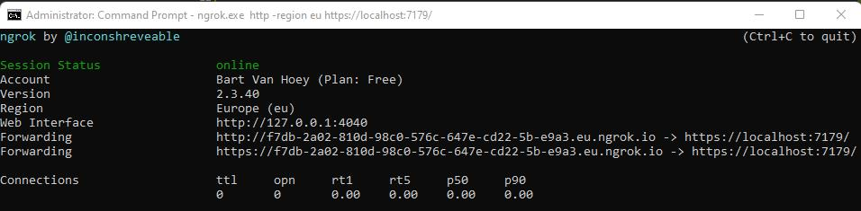

## ABP Framework (OpenIddict) consumed by .NET MAUI

## Introduction

From version 6.0.0 the ABP Framework will start to use **OpenIddict** instead of **IdentityServer**. In this article, I will show you how to consume an OpenIddict protected ABP Framework API from a .NET MAUI App.

The sample **BookStore ABP Framework** application in this article has been developed with **Blazor** as UI Framework and **SQL Server** as database provider.

### Source code

The source code of both projects is [available on GitHub](https://github.com/bartvanhoey/MauiAbpOpenIddict).

## Requirements

The following tools are needed to be able to run the solution and follow along.

* .NET 6.0 SDK
* VsCode, Visual Studio 2022 or another compatible IDE
* ABP CLI 6.0.0
* Ngrok

## ABP Framework application

### Create a new ABP Framework application

```bash
  abp new BookStore -u blazor -o BookStore
```

### Add the section below in the appsettings.json file of the DbMigrator project

```bash
    "BookStore_Maui": {
        "ClientId": "BookStore_Maui",
        "ClientSecret": "1q2w3e*",
        "RootUrl": "bookstore://"
    }
```

### Add a MauiBookStore section in the OpenIddictDataSeedContributor class of the Domain project

```bash
    // MauiBookStore Section
    var mauiScopes = new List<string>
    {
        "offline_access",
        OpenIddictConstants.Permissions.Scopes.Address,
        OpenIddictConstants.Permissions.Scopes.Email,
        OpenIddictConstants.Permissions.Scopes.Phone,
        OpenIddictConstants.Permissions.Scopes.Profile,
        OpenIddictConstants.Permissions.Scopes.Roles,
        "BookStore"
    };

    var mauiClientId = configurationSection["BookStore_Maui:ClientId"];
    if (!mauiClientId.IsNullOrWhiteSpace())
    {
        var mauiRootUrl = configurationSection["BookStore_Maui:RootUrl"];
        await CreateApplicationAsync(
            name: mauiClientId,
            type: OpenIddictConstants.ClientTypes.Confidential,
            consentType: OpenIddictConstants.ConsentTypes.Implicit,
            scopes: mauiScopes,
            grantTypes: new List<string>
            {
                OpenIddictConstants.GrantTypes.AuthorizationCode,
                OpenIddictConstants.GrantTypes.RefreshToken
            },
            secret: configurationSection["BookStore_Maui:ClientSecret"],
            redirectUri: $"{mauiRootUrl}",
            postLogoutRedirectUri: $"{mauiRootUrl}",
            displayName: "MauiBookStore"
        );
    }
```

### Apply Migrations and Run the Application

* To apply the settings above you need to run the DbMigrator project. After, check the **OpenIddictApplications** table of the database to see if the **BookStore_Maui** client has been added.
  
* Run the `BookStore.HttpApi.Host` application to start the API.

## Ngrok to the rescue

When you are running the ABP Framework API on your local computer, the endpoints are reachable on [https://localhost:\<your-port-number\>/api/\<path\>](https://localhost:<your-port-number>/api/\<path\>).

Although you can test out these localhost endpoints on your local machine, it will throw an exception in  a .NET MAUI app.

```bash
    System.Net.WebException: Failed to connect to localhost/127.0.0.1:44330 ---> Java.Net.ConnectException: Failed to connect to localhost/127.0.0.1:44330
```

A .NET MAUI app considers localhost as its own localhost address (mobile device or emulator) and not that of your computer.
To overcome this problem you can **make use of ngrok**. With ngrok you can **mirror your localhost address to a publicly available url**.

### Download and install ngrok

Go to the [ngrok page](https://ngrok.com/), create an account, and download and install Ngrok.

### Run the Ngrok command

Open a command prompt in the root of your ABP Framework project and enter the command below to start ngrok

```bash
    // change the <replace-me-with-the-abp-api-port> with the port where the Swagger page is running on
    ngrok.exe http -region eu https://localhost:<replace-with-the-abp-api-port-number>/
```

After running this command, you will receive the following output:
The API is now publicly available on [https://f7db-2a02-810d-98c0-576c-647e-cd22-5b-e9a3.eu.ngrok.io](https://f7db-2a02-810d-98c0-576c-647e-cd22-5b-e9a3.eu.ngrok.io)



### Copy the ngrok url

Copy the **lower forwarding url** as you will need it for use in the .NET MAUI app.

## .NET MAUI app

### Create a new .NET MAUI app

```bash
    abp new MauiBookStore -t maui -o MauiBookStore --preview
```

### Let's Install some nuget packages (in terminal window or nuget package manager)

```bash
    dotnet add package System.IdentityModel.Tokens.Jwt --version 6.23.0
    dotnet add package CommunityToolkit.Diagnostics --version 8.0.0
    dotnet add package CommunityToolkit.Mvvm --version 8.0.0
    dotnet add package IdentityModel --version 6.0.0
    dotnet add package IdentityModel.OidcClient --version 5.0.2
    dotnet add package Microsoft.Extensions.Configuration --version 6.0.1
    dotnet add package Microsoft.Extensions.Configuration.Binder --version 6.0.0
    dotnet add package Microsoft.Extensions.Configuration.Json --version 6.0.0
```

### Add an OpenIddictSettings section to the appsettings.json file

```bash
"OpenIddictSettings": {   
    "AuthorityUrl": "http://f974-2a02-810d-af3f-f0d8-c533-482a-68e2-8aa9.eu.ngrok.io", 
    "ClientId" : "BookStore_Maui",
    "RedirectUri" : "bookstore://",
    "Scope" : "openid offline_access address email profile roles BookStore",
    "ClientSecret" : "1q2w3e*"
}
```

### Add an OpenIddictSettings class to the Services/OpenIddict folder

```csharp
public class OpenIddictSettings
{
    public string AuthorityUrl { get; set; }
    public string ClientId { get; set; }
    public string RedirectUri { get; set; }
    public string Scope { get; set; }
    public string ClientSecret { get; set; }
}
```


AndroidManifest.xml(19, 5): [AMM0000] 
android:exported needs to be explicitly specified for element <activity#MauiBookStore.WebAuthenticationCallbackActivity>. Apps targeting Android 12 and higher are required to specify an explicit value for `android:exported` when the corresponding component has an intent filter defined. See https://developer.android.com/guide/topics/manifest/activity-element#exported for details.


```bash
	<application android:allowBackup="true" android:icon="@mipmap/appicon" android:roundIcon="@mipmap/appicon_round" android:supportsRtl="true">
		<activity android:exported="true" android:launchMode="singleTop" android:noHistory="true" android:name="EkapituroMaui.WebAuthenticationCallbackActivity">
			<intent-filter>
				<action android:name="android.intent.action.VIEW" />
				<category android:name="android.intent.category.DEFAULT" />
				<category android:name="android.intent.category.BROWSABLE" />
				<data android:scheme="ekapituro" />
			</intent-filter>
		</activity>
	</application>
```

### MainPage.xaml

Replace the content of the MainPage.xaml with the content below:

```html
<?xml version="1.0" encoding="utf-8" ?>
<ContentPage xmlns="http://schemas.microsoft.com/dotnet/2021/maui"
             xmlns:x="http://schemas.microsoft.com/winfx/2009/xaml"
             x:Class="MauiBookStore.Views.MainPage">

    <StackLayout Padding="10">
        <Image Source="dotnet_bot.png"
               SemanticProperties.Description="Cute dot net bot waving hi to you!"
               WidthRequest="200"
               HeightRequest="260"
               HorizontalOptions="Center" />

        <StackLayout Padding="40">
               <Entry Text="{Binding LoginUserName}" Placeholder="Enter user name..." />
               <Entry Text="{Binding LoginPassword}"  IsPassword="true" Placeholder="Enter password..." />
               <Button Text="Login"  FontAttributes="Bold" Command="{Binding LoginUserCommand}" HorizontalOptions="FillAndExpand" />       
        </StackLayout>
        
        <Label Margin="20" HorizontalOptions="Center"  Text="{Binding LoginUserMessage}" TextColor="Green"  FontSize="18" FontAttributes="Bold"/>
    </StackLayout>
</ContentPage>
```

### Update MainPage.xaml

```csharp
using MauiBookStore.ViewModels;
using Volo.Abp.DependencyInjection;

namespace MauiBookStore.Views
{
public partial class MainPage : ISingletonDependency
{
    public MainPage(MainViewModel mainViewModel)
    {
        BindingContext = mainViewModel;
        InitializeComponent();
        }
}
}
```

### MainViewModel.cs

Add a **MainViewModel** class in a **ViewModels** folder.

```csharp
using System.Windows.Input;
using MauiBookStore.Services.OpenIddict;
using MvvmHelpers;
using MvvmHelpers.Commands;

namespace MauiBookStore.ViewModels
{
    public class MainViewModel : BaseViewModel
    {
        private readonly IIdentityService _identityService;

        public MainViewModel(IIdentityService identityService) => _identityService = identityService;

        private string _loginUserMessage, _loginUserName, _loginPassword;
        private AsyncCommand _loginUserCommand;

        public ICommand LoginUserCommand => _loginUserCommand ??=new AsyncCommand(LoginUserAsync);
        private async Task LoginUserAsync() => LoginUserMessage = await _identityService.LoginAsync(LoginUserName, LoginPassword);

        public string LoginUserMessage
        {
            get => _loginUserMessage;
            set => SetProperty(ref _loginUserMessage, value);
        }

        public string LoginUserName
        {
            get => _loginUserName;
            set => SetProperty(ref _loginUserName, value);
        }

        public string LoginPassword
        {
            get => _loginPassword;
            set => SetProperty(ref _loginPassword, value);
        }
    }
}
```

### IdentityService.cs

Add an **IIdentityService** interface to a **Services/OpenIddict** folder

```csharp
public interface IIdentityService
{
    Task<string> LoginAsync(string userName, string password);
}
```

Add an **IdentityService** class to a **Services/OpenIddict** folder

```csharp
using System.Text;
using System.Text.Json;
using Microsoft.Extensions.Configuration;
// ReSharper disable InconsistentNaming

namespace MauiBookStore.Services.OpenIddict
{
    public class IdentityService : IIdentityService
    {
        private readonly IConfiguration _configuration;

        public IdentityService(IConfiguration configuration) => _configuration = configuration;

        public async Task<string> LoginAsync(string userName, string password)
        {
            var oiSettings = _configuration.GetSection(nameof(OpenIddictSettings)).Get<OpenIddictSettings>();
            var clientId = oiSettings.ClientId;
            var clientSecret = oiSettings.ClientSecret;
            var scope = oiSettings.Scope;
            var ngrokUrl = oiSettings.AuthorityUrl;

            var data = $"grant_type=password&username={userName}&password={password}&client_id={clientId}&client_secret={clientSecret}&scope={scope}";

            var content = new StringContent(data, Encoding.UTF8, "application/x-www-form-urlencoded");

            var httpClient = new HttpClient(GetHttpClientHandler());
            var response = await httpClient.PostAsync($"{ngrokUrl}/connect/token", content);
            response.EnsureSuccessStatusCode();

            var stringResult = await response.Content.ReadAsStringAsync();
            var loginResult = JsonSerializer.Deserialize<IdentityDto>(stringResult, Options);

            return string.IsNullOrWhiteSpace(loginResult?.access_token) ? "UnAuthorized" : "Login Successful!";
        }

        private HttpClientHandler GetHttpClientHandler()
        {
            // EXCEPTION: Javax.Net.Ssl.SSLHandshakeException: 'java.security.cert.CertPathValidatorException:
            // Trust anchor for certification path not found.'
            // SOLUTION: 
            // ATTENTION: DO NOT USE IN PRODUCTION 

            var httpClientHandler = new HttpClientHandler
            {
                ServerCertificateCustomValidationCallback = (message, cert, chain, errors) => { return true; }
            };

            return httpClientHandler;
        }

        private JsonSerializerOptions Options => new()
        {
            WriteIndented = true,
            PropertyNameCaseInsensitive = true
        };

    }

    public class IdentityDto
    {
        public string access_token { get; set; }
        public int expires_in { get; set; }
        public string token_type { get; set; }
        public string scope { get; set; }
        public string error { get; set; }
        public string error_description { get; set; }
    }
}

```

### Register Services

Open MauiProgram.cs and add the following services to the MauiAppBuilder, before the builder.Build() statement.

```csharp
    builder.Services.AddSingleton<IIdentityService, IdentityService>();
    builder.Services.AddTransient<MainViewModel>();
```

## Test the result

Run the **HttpApi.Host** project and make sure **Ngrok** is running too.
Start the **.NET Maui app**, enter the credentials (user name: **admin** - password: **1q2w3E***) and click the **Login** button.

Et voilà! As you can see, you received an access token from the **ABP Framework API**. Now you can start consuming the API!

Get the [source code](https://github.com/bartvanhoey/MauiAbpOpenIddict) on GitHub.

Enjoy and have fun!
